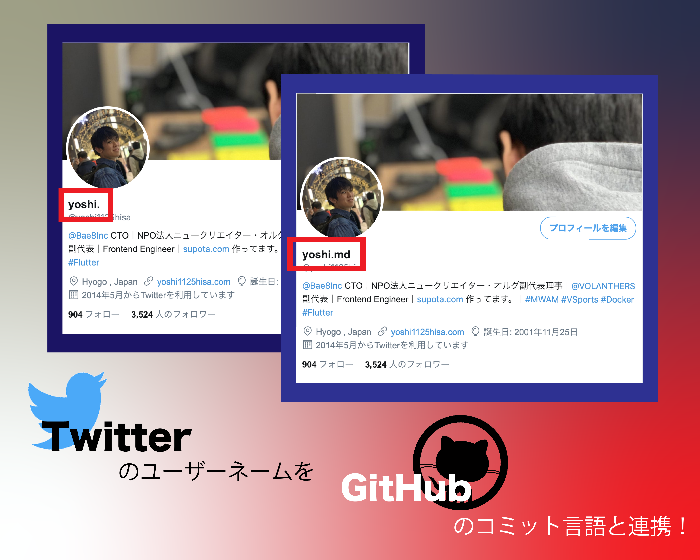

# Lang display - WIP

GitHubにコミットされたプログラミング言語の拡張を取得し、それに応じてTwitterのプロファイル名を変更するアプリケーションです。




## How2Run

### Local

```
$ git clone <THIS_REPOSITORY>
$ cd <THIS_REPOSITORY>
$ npm i
```

```
$ npm run start
```
### Docker

```
$ docker build -t lang-display .
# docker run -it lang-display ash

# express 導入後
# docker run -it -p 3000:3000 lang-display
```


---

## Specification

### Discription
Twitterのプロフィールに「.」を入れて認証すると、GitHubのコミット履歴を参照し、
その言語を拡張子として挿入する。
毎日0:00にcronで定期実行を行う。

`ex) yoshi. => yoshi.txt`

### Exception
- プロフィールの文字列が一定以上になった時
- 文字列末以外の `.` への反応
- コミット数が0の時どうするか？

---

## Flow

1. `/.env` を作成し、API Key等をかいていく
2. `UpdateAccount.js` でそれを読み込む
3. Twitter APIを叩く
4. `UpdateAccount.js` で書いた処理を `src/app.js` で実行する
5. GitHub APIに関してはTwitter APIの実装が終わった後